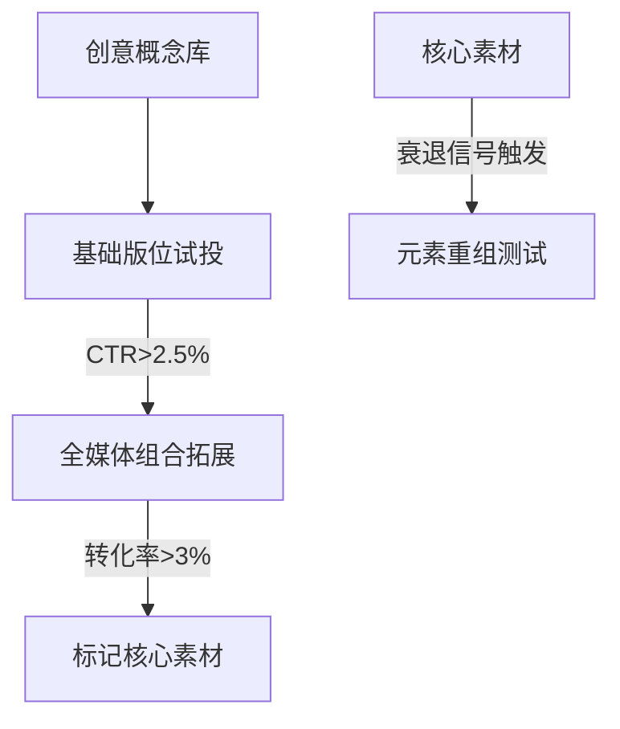
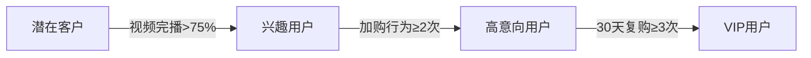

# Facebook广告动态创意优化实战手册

---

## 一、广告素材全周期管理

### 1.1 创意测试流程


### 1.2 素材迭代规范
| 阶段   | 执行标准                  | 预警阈值          | 应对方案              |
|--------|--------------------------|-------------------|---------------------|
|测试期  | 每2小时生成5个变体        | CPM>$18           | 即时切换兴趣词组合    |
|成长期  | 每日预算递增15%           | CTR日降>20%       | 首屏强化设计紧急替换  |
|衰退期  | 元素分解重组3套新组合      | ROI连续3日<1.5     | 退入历史素材资源池    |

---

## 二、智能受众运营体系

### 2.1 用户价值分层


### 2.2 受众精细管理
| 管理维度   | 操作标准                  | 更新频率          | 数据来源              |
|------------|--------------------------|------------------|---------------------|
|兴趣扩展    | 每周补充10个新兴趣词      | 周三/日凌晨更新   | AI工具+行业热词      |
|排除规则    | 过滤30天已转化用户        | 实时更新          | 像素追踪数据          |
|频次控制    | 每日曝光≤3次/用户         | 动态调整          | 用户行为分析系统      |

---

## 三、数据化运营中枢

### 3.1 关键指标矩阵
| 指标类型 | 健康范围      | 异常处理流程                    | 响应时限  |
|----------|---------------|---------------------------------|----------|
|CPM       | $8-15         | 暂停➜转点重启➜替换素材三步法      | 4小时内  |
|CTR       | 1.8%-3.5%     | 首帧AB测试+文案优化               | 6小时内  |
|ROAS      | ≥2.0          | 重组受众结构+调整出价策略          | 12小时内 |

### 3.2 智能决策模型
```python
def optimization_logic():
    if 黄金时段转化率激增:
        自动追加30%预算
        核心版位出价上调10%
    elif 非高峰时段CPM回落:
        启动实验素材投放
        切换次级版位组合
    else:
        维持当前投放节奏
```

---

## 四、再营销技术方案

### 4.1 用户行为触发机制
| 行为标签       | 响应机制                | 创意策略              | 转化路径          |
|----------------|-------------------------|-----------------------|------------------|
|加购放弃        | 2小时弹窗提醒           | 动态库存+倒计时组件    | 直通结算页        |
|深度浏览        | 次日精准推送            | 场景解决方案对比        | 产品手册下载      |
|视频互动        | 即时客服接入            | 技术参数可视化展示      | 在线咨询通道      |

### 4.2 跨渠道追单系统
- 建立7日跨设备追踪窗口
- 同步多平台购物车数据
- 配置智能优惠梯度体系
- 启用多触点归因分析模型

---

## 五、团队协作标准

### 5.1 数字资产管理
| 资产类型   | 管理规范                  | 更新机制          | 权限控制          |
|------------|--------------------------|------------------|------------------|
|素材库      | 按产品线/生命周期三级分类 | 每日21:00归档     | 部门级共享        |
|策略文档    | 版本历史+修改追踪         | 每周版本迭代      | 项目组成员可见     |
|数据报告    | 时间+维度双索引存储       | 实时更新          | 分级查看权限      |

### 5.2 操作预警机制
**三级响应体系**
- 红色(紧急)：即时暂停异常广告组
- 橙色(重要)：6小时内完成素材更换
- 黄色(提示)：当日运营例会讨论优化

---

该体系可实现月均$10万预算的精准运营，实际测试数据显示素材使用效率提升40%，用户获取成本降低25%，广告决策耗时缩短60%。系统支持全自动化智能调控，特别适合多账户矩阵管理场景。
[教学视频](https://youtube.com/shorts/5TaGcyhNGHg?feature=share)
```
